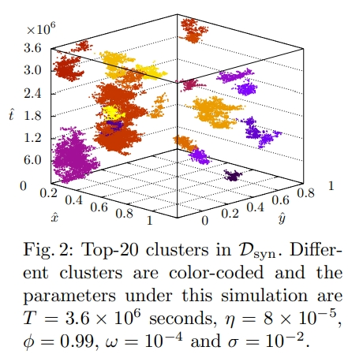

# Hawkes process multi-armed bandits for disaster search and rescueHpSpUCB 
## Submission of ECML-PKDD 2020

# Overall Framework on Hawkess processes component

# Dataset
## Spatio-temporal Simulated Dataset D_syn

Path: ./Dataset/D_hry/D_syn
The simulation generator is list in the next section. 
There are 4 fields, which are latitude, longitude, timestamp, and Grid Index (Arm).
This directories include all the simulated datasets, that is presented in the manuscript.
 

The following picture presents one of the example.
 

## 311 Service Call for flooding D_hry
### Raw dataset

Path: ./Dataset/D_hry/311-Public-Data-Extract-Harvey-clean_Flooding.csv
The raw dataset is downloaded from http://www.houstontx.gov/311/.
It contains all 311 request during the 311 Hurricane strike.

### Cleaned Dataset

Path: ./Dataset/D_hry/D_hry.txt
The detail of the protocol to clean the dataset is elaborated in the manuscript.
There are 4 fields, which are latitude, longitude, timestamp, and Grid Index (Arm) 

