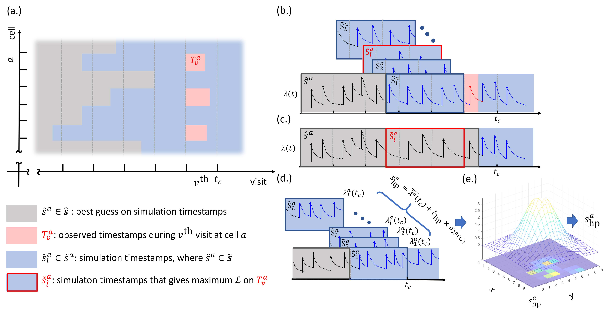
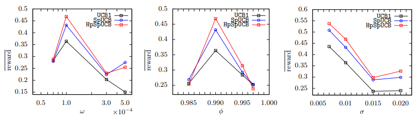
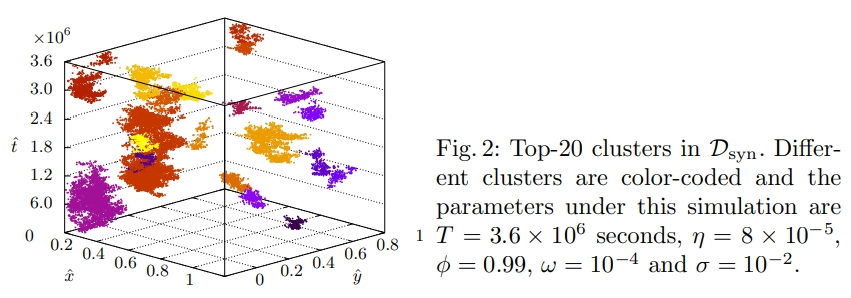

# Hawkes process multi-armed bandits for disaster search and rescue: HpSpUCB 
## Submission of ECML-PKDD 2020

# Overall Framework on Hawkess processes component

# Dataset
## Spatio-temporal Simulated Dataset D_syn

#### Path: ./Dataset/D_hry/D_syn
- The simulation generator is list in the next section. 
- There are 4 fields, which are latitude, longitude, timestamp, and Grid Index (Arm).
- This directories include all the simulated datasets, that is presented in the manuscript.

The following picture presents one of the example.

## 311 Service Call for flooding D_hry
### Raw dataset

#### Path: ./Dataset/D_hry/311-Public-Data-Extract-Harvey-clean_Flooding.csv
- The raw dataset is downloaded from http://www.houstontx.gov/311/.
- It contains all 311 request during the 311 Hurricane strike.

### Cleaned Dataset

#### Path: ./Dataset/D_hry/D_hry.txt
- The detail of the protocol to clean the dataset is elaborated in the manuscript.
- There are 4 fields, which are latitude, longitude, timestamp, and Grid Index (Arm) 

# Spatio-temporal dataset simulation
- Code is implemented in MATLAB. 
#### Path: ./Simulation

## Code
1. pois.m contains the function that draw samples from Possion Distribution
2. Hawkes_Simulation.m contains the function that run the simulation given the parameter.

Usage: function [times x y  offspring cluster_Id]=Hawkes_Simulation( η, φ, ω, T, σ)
Input:
T is the total simulation time.
η is the rate per second and T is the total time span.
φ governs the average number of offspring that an event spawns.
ω controls the waiting time between parent and offspring.
σ controls the spatial distance between parent and offspring event
Output:
times: Timestamps
x: Simulated longitude.
y: Simulated latitude.
offspring: A index to show whether it is offsprings or parents.
cluster_Id: It is the index to indicate which cluster it belongs to.

# Spatio-temporal Hawkes Processes Algorithm
1. CommandLineParamatize.py: This is the code to read in parameters
2. DataInput.py: This is the code to read in the input data file.
3. MAB.py: Main code to run multi-armed bandit algorithm.
4. HpSpUCB.py: The function that excecute the proposed model, HpSpUCB.
Usage: ./python3 -W ignore MAB.py UnbDataPath=data_path ResultsPath=path_results Method=HpSpUCB NumArm=100 NumPulledArm=5 PeriodPerPull=7200 Gamma=0.1 Lambda=0.1 Delta=0.2 Tau=0.1 AlphaR=0.1 AlphaH=0.1 nsample=50 SimTime=1
Input:
UnbDataPath: Specify the input data path with four fields, Time, latitude, longitude, and grid index.
ResultsPath: This is to keep track of every pull results.
Method: To specify the method. 
NumArm: The number of arms in total.
NumPulledArm: The number of arms that we pull each visit.
PeriodPerPull: The period between each pull.
# Hyper Parameter
Gamma: The weight betwee the proposed Hawkes processes component and the exsisted component.
Lambda: The standward deviation used in Gaussian process and Gaussian filter.
Delta: The standward deviation used in the Metropolis-Hastings sampling method.
Tau: The temporature for softmax function.
AlphaR: The weight on the upper confidence bound on rewards.
AlphaH: The weight on the uppper conficence bound on event intensities.
nsample: The number of samples to draw from posterior distribution. 
SimTime: Simulation time for diffrent initial positions.

Num 
